  

  

  

---

### 🎨 About me

- 🌱 **Student & hobbyist dev** teaching myself to build beautiful, interactive things.
- ⚡ Into **design-driven front-end**: clean UI, smooth motion, and the small details.
- 🛠️ Going deep on **React + TypeScript**, currently descending into **Three.js / WebGL / GLSL** from first principles — scene graphs, PBR, shaders, the glTF pipeline.
- 🎯 This year's goal: fluent React + TS, and one polished 3D web thing.
- 💬 Ask me about anything I'm building — I love sharing.

---

### 🧠 The Design & Code vault

Everything I build starts in my **"Design & Code" vault** — a **942-note design brain** in Obsidian that I grow as I learn. It has three wings:

| Wing | What's inside |
| --- | --- |
| 🎛 **UI Libraries** | **4,539 captured components** across 8 React registries (Aceternity, Magic UI, shadcn, Cult, Fancy, Eldora, Kokonut, Motion Primitives) + 3,802 raw HTML/CSS elements from UIverse — each with source, deps, and props |
| 🧬 **ReactBits** | **134 animated React components** — text effects, cursor animations, shader backgrounds — every note carries full code, props tables, and install steps |
| 📚 **Knowledge Hub** | 2025–26 reference notes on **design** (OKLCH, tokens, WCAG 2.2), **coding** (strict TS, React architecture), **security** (OWASP, RLS), **3D & WebGL**, **SaaS**, and **iOS/Swift** |

A few through-lines I try to build by:

> **Design:** build the token layer; adopt everything above it. · **Code:** optimize for the cost of the *next change*. · **Security:** the client enforces nothing that matters. · **3D:** it's just a scene graph photographed 60×/sec.

---

### 🧰 My stack

<b>Languages</b>

  
  
  
  
  
  
  
  
  

<b>Frameworks &amp; Tools</b>

  
  
  
  
  
  
  
  
  
  

---

### 📊 GitHub stats

  
  

  

  

<!-- ===== TROPHIES ===== -->

  

---

  <i>Thanks for stopping by — more coming soon 🚧</i>
    
  

