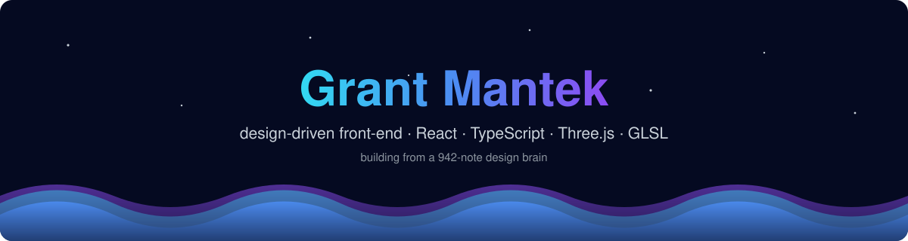
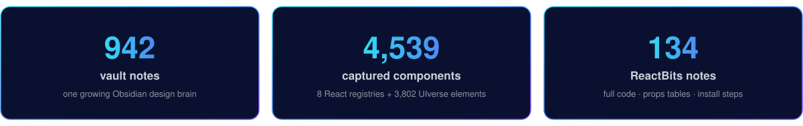

  
    
  

 

  Student &amp; hobbyist dev out of Charleston. I collect UI patterns, animation, and 3D/WebGL knowledge into an Obsidian vault —
  <b>then build from it</b>. Currently descending into Three.js &amp; GLSL from first principles: scene graphs, PBR, shaders, the glTF pipeline.

  

 

<table width="100%">
  <tr>
    <td width="50%" valign="top">
      <h3>🧊 3D &amp; shaders</h3>
      <ul>
        <li><a href="https://github.com/Grantmantek/fluxform"><b>fluxform</b></a> — interactive Three.js GLSL shader toy</li>
        <li><a href="https://github.com/Grantmantek/threejs-shader-playground"><b>threejs-shader-playground</b></a> — live GLSL editor, uniform sliders, shareable URLs</li>
        <li><a href="https://github.com/Grantmantek/threejs-scroll-scene"><b>threejs-scroll-scene</b></a> — scroll-driven camera path, reduced-motion fallback</li>
        <li><a href="https://github.com/Grantmantek/threejs-product-configurator"><b>threejs-product-configurator</b></a> — orbit, swap materials, export PNG</li>
      </ul>
    </td>
    <td width="50%" valign="top">
      <h3>🎨 Canvas experiments</h3>
      <ul>
        <li><a href="https://github.com/Grantmantek/canvas-particle-field"><b>canvas-particle-field</b></a> — zero-dep, pointer-reactive particles</li>
        <li><a href="https://github.com/Grantmantek/canvas-image-editor"><b>canvas-image-editor</b></a> — crop/rotate/adjust, full-res export</li>
        <li><a href="https://github.com/Grantmantek/canvas-signature-pad"><b>canvas-signature-pad</b></a> — pressure-sensitive, PNG + SVG export</li>
        <li><a href="https://github.com/Grantmantek/canvas-chart-lite"><b>canvas-chart-lite</b></a> — tiny animated charts, no dependencies</li>
      </ul>
    </td>
  </tr>
  <tr>
    <td width="50%" valign="top">
      <h3>🧱 Front-end foundations</h3>
      <ul>
        <li><a href="https://github.com/Grantmantek/design-tokens-pipeline"><b>design-tokens-pipeline</b></a> — one <code>tokens.json</code> → CSS vars, Tailwind, TS types</li>
        <li><a href="https://github.com/Grantmantek/tailwind-landing-kit"><b>tailwind-landing-kit</b></a> — accessible 8-section starter, dark mode</li>
        <li><a href="https://github.com/Grantmantek/css-scroll-effects"><b>css-scroll-effects</b></a> — parallax, reveal, sticky stack — CSS-first</li>
      </ul>
    </td>
    <td width="50%" valign="top">
      <h3>🤖 Hardware</h3>
      <ul>
        <li><a href="https://github.com/Grantmantek/robot-arm"><b>robot-arm</b></a> — 3-servo Arduino arm: GUI, web panel, face tracking</li>
        <li><a href="https://github.com/Grantmantek/gesture-cam-rig"><b>gesture-cam-rig</b></a> — pan/tilt rig: face tracking + gesture air-mouse</li>
      </ul>
    </td>
  </tr>
</table>

 

<h3 align="center">🧰 Stack</h3>

  
  
  
  
  
  
  
   
  
  
  
  
  
  
  
  

  <b>How I try to build:</b> design the token layer, adopt everything above it · optimize for the cost of the next change · 
  the client enforces nothing that matters · 3D is just a scene graph photographed 60×/sec

 

<h3 align="center">📊 Stats</h3>

  
  

  

  

  Anything public is forkable — thanks for stopping by 👋
    
  

